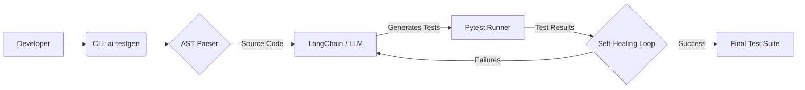

<<<<<<< HEAD
# AI-Powered Test Automation Framework


An AI-powered test automation tool that analyzes Python source code, generates robust pytest test suites using Large Language Models (LLMs), and automatically self-heals failing tests through an iterative feedback loop.

## Architecture



## Features
- Automatically parses and analyzes Python code using AST.
- Generates comprehensive unit tests with edge cases using LangChain and Google's Gemini models.
- Executes tests in a sandboxed environment using `pytest`.
- Iterative self-healing process to fix generated tests that fail.
- Detailed HTML and coverage reporting.

## Quick Start

1. **Clone the repo:**
   ```bash
   git clone https://github.com/yourusername/ai-test-framework.git
   cd ai-test-framework
   ```

2. **Install dependencies:**
   ```bash
   pip install -r requirements.txt
   pip install -r requirements-dev.txt
   ```

3. **Get an API Key:**
   Get your free API key from [Google AI Studio](https://aistudio.google.com/).

4. **Configure Environment:**
   ```bash
   cp .env.example .env
   # Edit .env and set GOOGLE_API_KEY=your_api_key_here
   ```

5. **Generate tests:**
   ```bash
   ai-testgen generate examples/calculator.py
   ```

6. **Run generated tests:**
   ```bash
   pytest examples/generated/ -v
   ```

## Tech Stack

| Component | Technology |
|---|---|
| Language | Python 3.12 |
| LLM Integration | LangChain, Google Gemini API |
| Testing | Pytest, Pytest-cov, Pytest-html |
| Linting / Formatting | Ruff |
| Configuration | Pydantic v2 |
| Logging | Loguru |
| CLI | argparse |

## Project Structure

```
├── .github/
│   └── workflows/
│       └── test.yml
├── examples/
│   ├── calculator.py
│   └── generated/
│       └── .gitkeep
├── src/
│   ├── models/
│   ├── parser/
│   ├── llm/
│   ├── runner/
│   ├── cli.py
│   └── config.py
├── tests/
├── README.md
├── requirements.txt
└── requirements-dev.txt
```

## How It Works

The AI Test Generator uses a **Self-Healing Loop** to ensure test reliability. 
1. The **AST Parser** extracts the structure of the target Python file (functions, classes, docstrings).
2. The **LLM** (via LangChain) generates an initial `pytest` suite for the parsed code.
3. The **Pytest Runner** executes the generated tests.
4. If tests fail, the error outputs and tracebacks are fed back to the LLM to analyze and correct the tests. This loop repeats until the tests pass or a maximum iteration limit is reached.

## Running Tests

To run the framework's own test suite with coverage:
```bash
pytest tests/ -v --cov=src
```

## License

MIT
